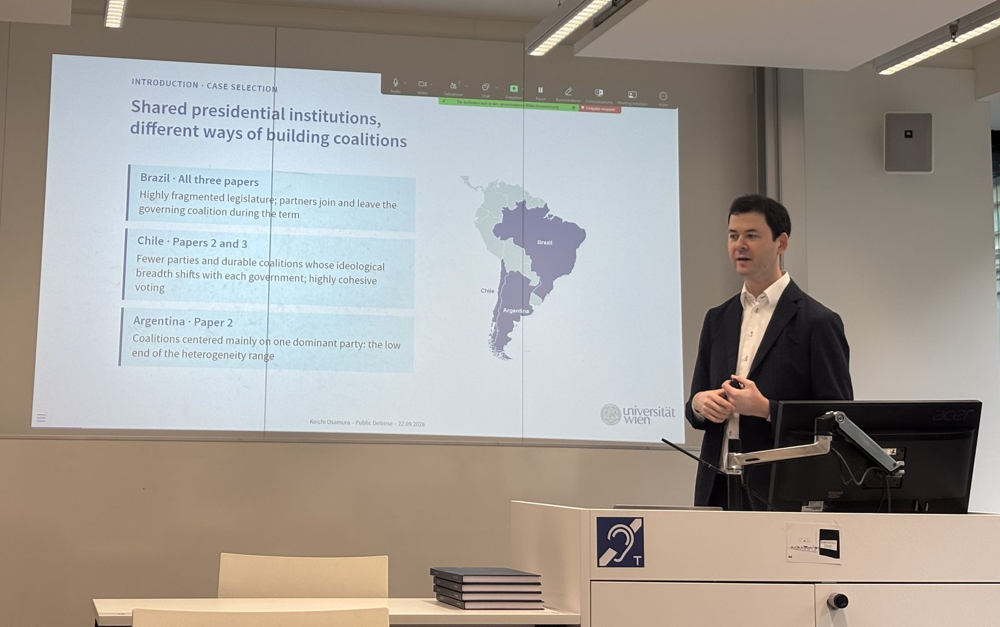
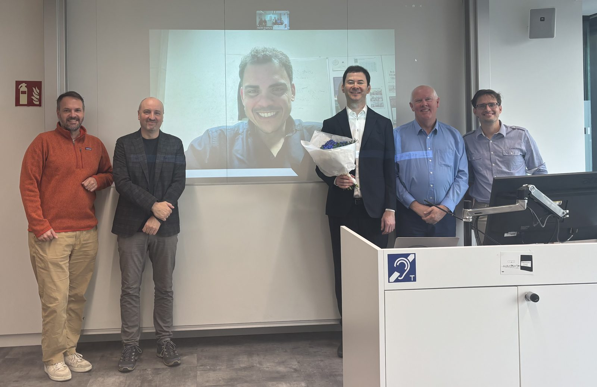

::: {.hero}
::: {.hero-text}
[Political Scientist · Research Fellow at the University of Vienna]{.kicker}

```{=html}
<h1 class="hero-name">Koichi Osamura</h1>
```

::: {.lead}
I study coalition politics, legislative behavior, and party competition, above all in multiparty presidential systems.
:::

I am a research fellow at the Department of Government, University of Vienna, where I obtained my doctorate in Political Science. Besides my substantive work, I enjoy learning new methods and techniques.
<!-- ::: {.nav-buttons} -->
<!-- [Research](research.qmd){.solid} [CV (PDF)](cv_osamura_30092026.pdf) [Contact](#contact) -->
<!-- ::: -->
:::

::: {.hero-photo .circle}
{.nolightbox fig-alt="Koichi Osamura"}
:::
:::

::: {.section-head}
[Research]{.kicker}

## What I work on
:::

::: {.boxes}
::: {.box}
[Coalition politics]{.box-title}

How presidents build and keep legislative support in multiparty systems, and what motivates parties and legislators to join and support a coalition.
:::

::: {.box}
[Legislative behavior]{.box-title}

Party cohesion, deviation, and roll-call voting, with a focus on South American legislatures.
:::

::: {.box}
[Portfolio design]{.box-title}

How governments create, merge, and reallocate ministerial portfolios in European democracies.
:::

::: {.box}
[Methods]{.box-title}

Analysis of electoral outcomes, expert surveys, bureaucratic appointments; Text analysis.
:::
:::


::: {.section-head}
[Latest]{.kicker}

## Recent work
:::

::: {.pub}
[Party Politics · 2026 · OnlineFirst]{.kicker}

[[Bureaucratic appointments and coalition support in presidential systems: An analysis of Brazil's Chamber of Deputies](https://doi.org/10.1177/13540688261466129){target="_blank" .no-arrow}]{.pub-title}

[Osamura, K.]{.meta}
:::

::: {.entry .with-photo}
::: {.entry-meta}
**Sep 2026**\
Doctoral defense
:::
::: {.entry-body}
Defended my doctoral dissertation, *Seeking Office, Policy, or Votes? An Analysis of Legislative Coalitions, Motivations, and Behavior in Multiparty Presidential Systems*, at the University of Vienna
:::
::: {.entry-photo}
{.lightbox group="defense" description="Presenting the dissertation at the public defense, 22 September 2026" fig-alt="Koichi Osamura presenting at his PhD defense"}

[2 photos]{.photo-count}

::: {.lightbox-extra}
{.lightbox group="defense" description="With the committee and supervisors after the defense" fig-alt="Koichi Osamura with his committee and supervisors after the defense"}
:::
:::
:::

::: {.entry}
::: {.entry-meta}
**Jun 2026**\
Podcast · Expresso
:::
::: {.entry-body}
[Why can't Japan have its first modern empress?](https://expresso.pt/podcasts/o-mundo-a-seus-pes/2026-06-15-porque-e-que-o-japao-nao-pode-ter-a-sua-primeira-imperatriz-moderna--09135007){target="_blank"}
:::
:::

::: {.entry}
::: {.entry-meta}
**Jun 2026**\
Article · Expresso
:::
::: {.entry-body}
[The Russian playbook for dividing Europe](https://expresso.pt/uniao-europeia/2026-06-08-cabecas-de-porco-em-mesquitas-apartamento-de-luxo-no-dubai-e-nostalgia-dos-habsburgos-o-manual-russo-para-fraturar-a-europa-930d7734){target="_blank"}
:::
:::

::: {.entry}
::: {.entry-meta}
**Jun 2026**\
Conference · Belfast
:::
::: {.entry-body}
Presented *Tailoring ministerial office to office holders* at the EPSS 2026 Annual Conference
:::
:::

<!-- ::: {.nav-buttons} -->
<!-- [All research](research.qmd) [All media](media.qmd) -->
<!-- ::: -->


::: {.section-head #contact}
[Contact]{.kicker}

## Get in touch
:::

::: {.contact}
::: {}
[Email]{.kicker}

koichi.osamura[at]univie.ac.at

<br>

[Address]{.kicker}

Department of Government\
University of Vienna\
Rooseveltplatz 3, 1090 Vienna, Austria
:::

::: {.links}
[Elsewhere]{.kicker}

[ LinkedIn](https://www.linkedin.com/in/koichiosamura){target="_blank"}

[ Bluesky](https://bsky.app/profile/koichiosamura.bsky.social){target="_blank"}

[ ORCID](https://orcid.org/0000-0001-8907-9138){target="_blank"}

[ GitHub](https://github.com/koichiosamura){target="_blank"}
:::
:::
